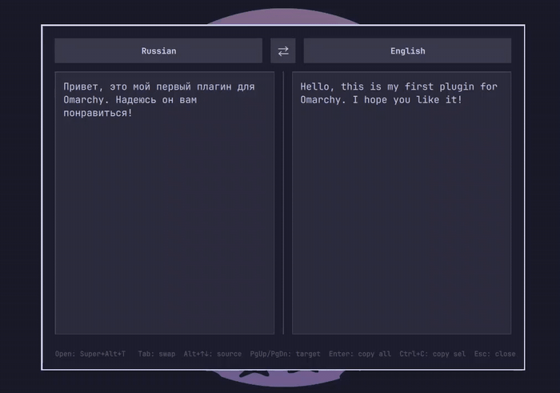
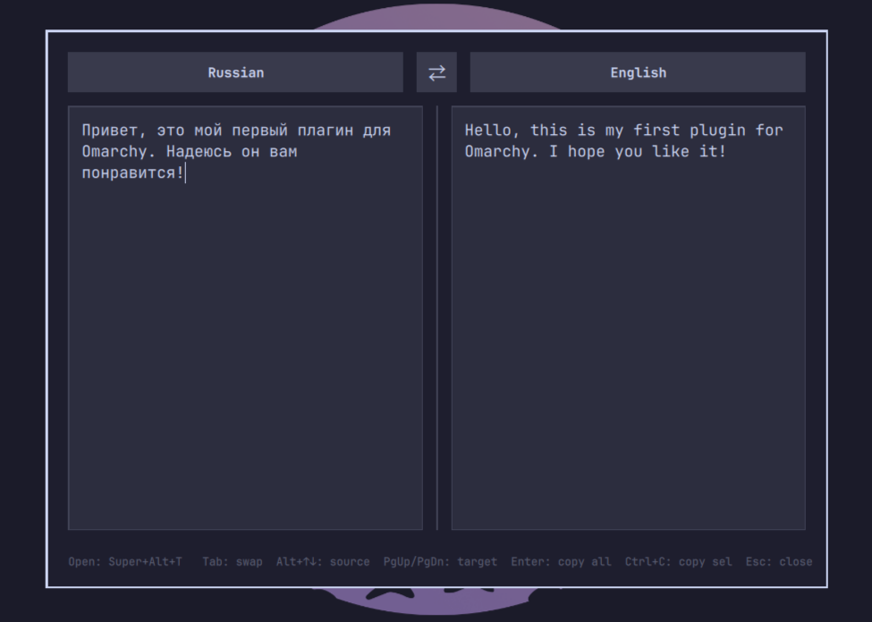

# Google Translate

An Omarchy overlay that translates selected text with a hotkey, powered by
Google Translate.

## Features

- Select any text and press the hotkey — the selection is translated instantly
- Works out of the box: the plugin registers its own hotkey on first run, so no
  hand-edited keybindings are needed
- Falls back to the clipboard, or just type into the source pane
- Auto-detect language, source/target language switching and swap
- Both panes support text selection: copy the whole translation with `Enter`,
  or select a part and copy it with `Ctrl+C` (the output pane is read-only)

## Demo





## Requirements

- Omarchy with the Quattro shell
- `python3` (any recent 3.x; uses the standard library only)
- `wl-clipboard` for capturing the current selection (`wl-paste`)
- Network access to `translate.google.com`

## Install

```sh
omarchy plugin add https://github.com/GodofJoper/omarchy-google-translate.git --enable
```

## Hotkey

On first run the plugin registers the **SUPER + ALT + T** binding in
`~/.config/hypr/bindings.lua` and reloads Hyprland, so it works with no manual
configuration. The binding is kept in sync: Hyprland config reloads re-apply it,
and the plugin stores one timestamped backup (`bindings.lua.bak.google-translate.<ts>`)
next to the config each time the binding changes. Only the line whose description
is `Google Translate` is ever touched.

> Note: Hyprland in Lua mode has no working runtime-only binding path (`hyprctl
> eval` binds never dispatch), which is why the plugin regenerates the config
> line instead.

Control it from the command line:

| Command | Effect |
| --- | --- |
| `omarchy-shell shell call godofjoper.translate hotkeyStatus ''` | Show the active hotkey |
| `omarchy-shell shell call godofjoper.translate setHotkey 'SUPER + SHIFT + T'` | Change the hotkey (existing combos are refused with an error) |
| `omarchy-shell shell call godofjoper.translate setHotkeyEnabled false` | Unbind the hotkey |
| `omarchy-shell shell call godofjoper.translate setHotkeyEnabled true` | Restore it |
| `omarchy-shell shell toggle godofjoper.translate` | Open the overlay directly, bypassing the hotkey |

If your preferred key is already taken, the plugin tries a fallback
(`SUPER + SHIFT + T`, `SUPER + ALT + G`) and notifies you once. Preferences live
in `~/.config/omarchy/google-translate.settings.json`.

The `capture.sh` script captures the current selection *before* the overlay
takes keyboard focus (the focus steal makes the source app release the primary
selection), then toggles the overlay. Priority: highlighted text → clipboard →
empty.

Captured text is capped at 1 MiB and stored in a private directory/file
(`0700`/`0600`, atomically renamed, never following symlinks) at
`~/.local/state/omarchy/translate-selection.txt`. The text travels to the
translator over stdin and its HTTP request body only — it is never passed as a
process argument or placed in a URL. Input, request response, and rendered
output are all byte-limited; oversized selections or responses are rejected
instead of buffered.

## Usage

Select text anywhere and press the hotkey. The overlay opens with the text
ready and translates it automatically. If nothing was selected, an empty source
field is ready for manual typing.

| Key | Action |
| --- | --- |
| `Esc` | Close |
| `Tab` | Swap source and target language |
| `Alt+↑` / `Alt+↓` | Change source language |
| `PgUp` / `PgDn` | Change target language |
| `↑` / `↓` | Move the cursor / extend selection; with an empty source field they cycle the target language |
| `Enter` | Copy the whole translation |
| `Ctrl+C` | Copy the selected text in the focused pane |
| `Ctrl+A`, `Ctrl+Shift+arrows`, mouse drag | Select text in either pane (the output pane is read-only) |

## Remove

```sh
omarchy plugin remove godofjoper.translate
```

Disabling the plugin while it is running (`setHotkeyEnabled false`) unbinds the
hotkey immediately. Removing the plugin while the shell is running also strips
the `Google Translate` line from `bindings.lua` during shutdown; if you remove it
while the shell is stopped, delete that line manually and run `hyprctl reload`.

The state file `~/.local/state/omarchy/translate-selection.txt` (the last
captured text) is left behind and can be deleted.

## Privacy

The selected or pasted text is sent to `translate.google.com` to produce a
translation — the same as pasting it into Google Translate in a browser.
Nothing else leaves your machine: no account, no API key, no analytics.

This is an independent, unofficial project and is not affiliated with or
endorsed by Google.